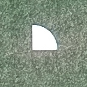
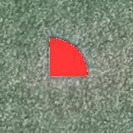

# threshold_color_changer

## Functionality

Uses a threshold value so that anything with all three (r,g,b) greater than the value will selected.
The selected portions have a delta_rgb in (r,g,b) format that will be subtracted from the initial values.
The result is then bounded between 0 and 255 to not escape the rgb limits.

An example below shows the result after applying a threshold of 200 and a delta_rgb of (0,200,200).
Original:

Result:
